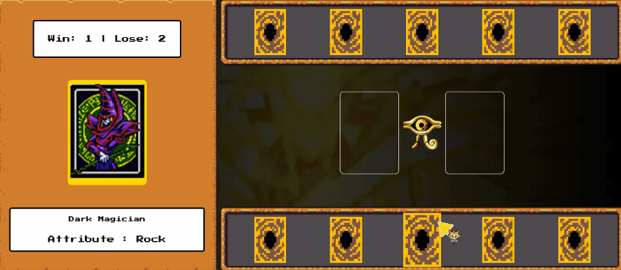

# Yu-Gi-Oh | Jo-ken-po Edition
## Esse jogo foi desenvolvido durante o Bootcamp: Potência Tech iFood - Desenvolvimento de Jogos

### Tecnologias Utilizadas

- HTML5 e CSS3:
  - Para a estrutura e aparência do jogo.
- JavaScript:
  - Para a lógica de programação e interatividade.

Conceitos abordados:

- Armazenamento e gerenciamento de estado manual
- Funções limpas
- Organização de código
